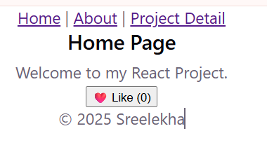
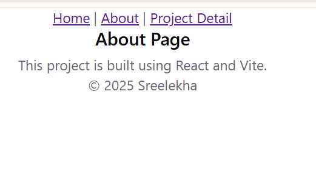
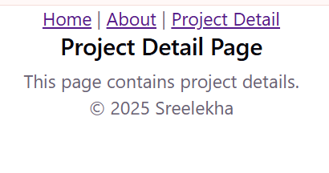
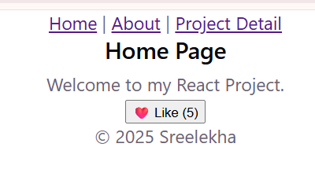

# 🚀 Mission 3 - React Portfolio Website

## 📌 Project Overview

This project was developed as part of the **VertexMind Web Development Internship**.

The application is built using **React** and **Vite** to create a modern, responsive portfolio website. It demonstrates reusable React components, client-side routing with **React Router DOM**, and state management using the **useState** hook. The project follows a clean and modular folder structure, making it scalable and easy to maintain.

---

## 🌐 Live Demo

🔗 https://mission-3-eta.vercel.app/

---

## 💻 GitHub Repository

🔗 https://github.com/PVSREELEKHA2007/Mission-3

---

## 🛠️ Technologies Used

- React.js
- Vite
- JavaScript (ES6)
- HTML5
- CSS3
- React Router DOM

---

## ✨ Features

- ✅ Responsive Navigation Bar
- ✅ Home Page
- ✅ About Page
- ✅ Projects Page
- ✅ Project Details Page
- ✅ Client-side Routing using React Router
- ✅ Reusable React Components
- ✅ State Management using `useState`
- ✅ Responsive Design
- ✅ Fast Development with Vite
- ✅ Clean and Organized Code Structure

---

## 📁 Project Structure

```text
Mission-3/
│
├── public/
│
├── src/
│   ├── assets/
│   ├── components/
│   ├── pages/
│   ├── App.jsx
│   └── main.jsx
│
├── package.json
├── vite.config.js
└── README.md
```

---

## ⚙️ Installation

### 1️⃣ Clone the Repository

```bash
git clone https://github.com/PVSREELEKHA2007/Mission-3.git
```

### 2️⃣ Navigate to the Project Folder

```bash
cd Mission-3
```

### 3️⃣ Install Dependencies

```bash
npm install
```

### 4️⃣ Run the Development Server

```bash
npm run dev
```

### 5️⃣ Open in Your Browser

```text
http://localhost:5173
```

---

## 🎯 Learning Outcomes

Through this project, I gained practical experience in:

- Building Single Page Applications (SPA)
- Creating reusable React components
- Client-side routing with React Router
- Managing state using React Hooks (`useState`)
- Developing responsive user interfaces
- Organizing React project structure
- Deploying React applications using Vercel

---

## 📸 Screenshots

### 🏠 Home Page



### 👤 About Page



### 📄 Project Detail Page



### ❤️ Like Button


## 👩‍💻 Author

**Sreelekha**

AI & Data Science Student  
VertexMind Web Development Intern

GitHub: https://github.com/PVSREELEKHA2007

---

## 📜 License

This project was developed for educational purposes as part of the **VertexMind Web Development Internship**.
